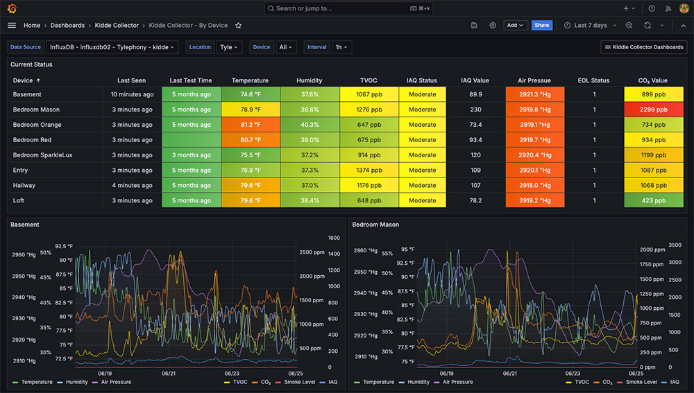
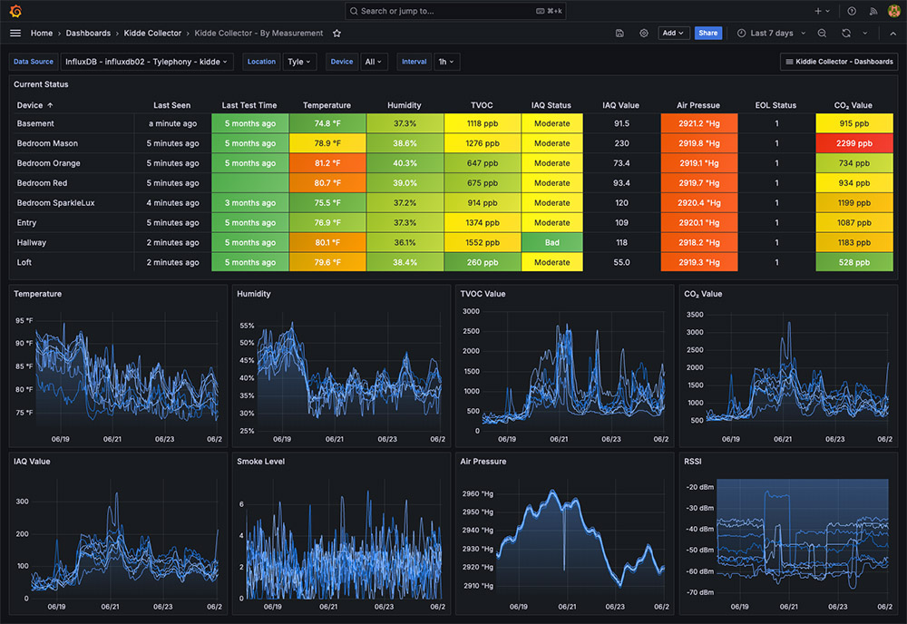

# Kidde Collector

A headless **Python** data collector that polls the **Kidde HomeSafe** cloud API for smart smoke / CO / air-quality detector metrics and writes them to **InfluxDB** for monitoring and visualization in **Grafana**. It reaches OUT to Kidde and OUT to InfluxDB — it publishes **no inbound port**.

Part of the Luxardo Labs collector fleet; follows the collector fleet standard with **kasa-collector** as the reference implementation.



## Features

- Collects smoke / CO / air-quality detector metrics from the **Kidde HomeSafe** cloud API.
- Stores device + air-quality data in **InfluxDB** as time series.
- Ships **pre-built Grafana dashboards** ("By Device" and "By Measurement"), auto-provisioned in the dev/demo stacks.
- **Docker-first** — a self-contained demo stack (`make demo-up`) runs with no Kidde account or hardware.

## Quickstart (no Kidde account, no hardware)

```bash
make demo-up      # fake Kidde endpoint + bundled InfluxDB + Grafana
# Grafana http://localhost:3000 (admin/admin) — dashboards populate from the fake feed
# Override ports if 3000/8086 are taken:  GRAFANA_PORT=13400 INFLUX_PORT=18186 make demo-up
make demo-down
```

## Common commands

The `Makefile` is the source of truth; `VERSION` (repo root) is the version source of truth.

```bash
make help          # grouped command help
make build-local   # build the runtime image from current source (no push)
make test-e2e      # hardware-free end-to-end: fake Kidde -> collector -> InfluxDB, asserted
make demo-up       # self-contained demo (fake Kidde + InfluxDB + Grafana)
make dev-up        # dev stack: real Kidde account + bundled InfluxDB + Grafana
make up            # collector-only, against YOUR external InfluxDB (edit .env.dev)

make lint          # luxlint: canonical ruff + mypy + docstrings + secret-config guard
make test          # pytest suite (canonical config, lock-built image)
make arch          # luxarch: architecture conformance
make audit         # luxaudit: dependency-CVE scan (live OSV + PyPA feed)
make check         # everything: lint + arch + audit + test + secret scan
make poetry-lock   # regenerate poetry.lock (poetry-in-docker; no host poetry needed)
make release       # build + push :VERSION + :latest (multi-arch) to the private registry

# Run directly (after setting env; see Configuration)
python -m app.main
python -m app.health.check   # container healthcheck
```

Dependencies are managed with **Poetry** (`pyproject.toml` + committed `poetry.lock`); there is no `requirements.txt`.

## The four run stacks

Distinguished by source (real vs fake Kidde) and observability (external vs bundled). All `.yml`, short-form volumes, on the **bridge network** (Kidde is a cloud API — no host networking). Compose never builds except the fake-Kidde service in demo/e2e.

| Stack          | compose file                         | source          | InfluxDB/Grafana          | make                 |
| -------------- | ------------------------------------ | --------------- | ------------------------- | -------------------- |
| collector-only | `compose.yml` (+ `compose.prod.yml`) | real            | external (your fleet)     | `make up` / `prod-*` |
| dev            | `compose.dev.yml`                    | real            | bundled, auto-provisioned | `make dev-up`        |
| demo           | `compose.demo.yml`                   | fake (emulator) | bundled, auto-provisioned | `make demo-up`       |
| test           | `compose.e2e.yml`                    | fake            | ephemeral, no Grafana     | `make test-e2e`      |

## Configuration

All config is via `KIDDE_COLLECTOR_*` environment variables (see `app/core/config.py`). **Secrets live in gitignored `.env.dev` / `.env.prod`** (copy from `.env.example`); the dev stack layers an optional gitignored `.env.dev.local` (copy from `.env.dev.local.example`) with your real Kidde account. `.env.demo` is committed, non-secret bundled-stack config.

Required: `INFLUXDB_URL`, `INFLUXDB_TOKEN`, `INFLUXDB_ORG`, `INFLUXDB_BUCKET`, `KIDDE_USERNAME`, `KIDDE_PASSWORD` (all `KIDDE_COLLECTOR_`-prefixed). The full list of knobs (defaults, bounds) is in [`docs/CONFIGURATION.md`](docs/CONFIGURATION.md).

## Data model

One measurement, `kidde_collector_device`:

- **tags**: `id`, `serial_number`, `location_id`, `location_label`, `label`
- **fields**: every scalar device attribute (`smoke_alarm`, `co_level`, `temperature`, `battery_state`, `smoke_level`, …), plus per-metric `{name}_value` / `{name}_status` for the air-quality panel: `iaq_temperature`, `humidity`, `hpa`, `tvoc`, `iaq`, `co2`.

Two Grafana dashboards (`grafana/shared-local/`) — "By Device" and "By Measurement" — are auto-provisioned in the dev/demo stacks.



## Documentation

- [Getting Started](docs/GETTING-STARTED.md) — prerequisites and the three ways to run it.
- [Deployment](docs/DEPLOYMENT.md) — the published image, Compose, and remote/production deploys.
- [Configuration](docs/CONFIGURATION.md) — every `KIDDE_COLLECTOR_*` variable, defaults, and bounds.
- [Grafana Dashboards](docs/DASHBOARDS.md) — the dashboards, datasource/DBRP, and importing into your own Grafana.
- [Troubleshooting](docs/TROUBLESHOOTING.md) — no data, offline devices, re-auth, port clashes, and more.
- [Contributing](CONTRIBUTING.md) — dev setup and how to submit a change.

## Support

Questions or issues? Please [open an issue](https://github.com/luxardolabs/kidde-collector/issues) on the project repository.

## License

[AGPL-3.0-only](LICENSE).
